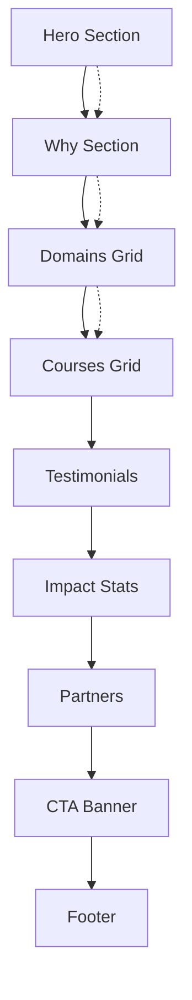

## 1. Product Overview
Skillsphere is a premium one-page landing website that positions itself as a global hub for curated, verified, and guided online learning. The platform targets learners from rural and low-income backgrounds, providing clarity in the overwhelming world of endless online courses through expert curation and personalized guidance.

The landing page serves as the primary touchpoint to communicate credibility, showcase value propositions, and drive user engagement through a sophisticated, editorial design aesthetic.

## 2. Core Features

### 2.1 User Roles
| Role | Registration Method | Core Permissions |
|------|---------------------|------------------|
| Visitor | No registration required | Browse landing page content, search courses, view testimonials |
| Learner | Email registration | Access full course catalog, receive personalized guidance |

### 2.2 Feature Module
The Skillsphere landing page consists of the following essential sections:
1. **Header Navigation**: Sticky glass header with logo, navigation links, and CTA button
2. **Hero Section**: Impactful headline, search functionality, and secondary CTAs
3. **Value Proposition**: Three feature cards explaining curation, accessibility, and mentorship
4. **Learning Domains**: Six domain categories with tactile card design
5. **Featured Courses**: Curated course showcase with metadata and actions
6. **Social Proof**: Testimonials and impact statistics
7. **Partners Section**: Trust-building logo display
8. **Call-to-Action Banner**: Conversion-focused banner with primary CTA
9. **Footer**: Brand information and copyright

### 2.3 Page Details
| Section Name | Module Name | Feature description |
|-------------|-------------|---------------------|
| Header | Navigation | Sticky glass header with logo "SkillSphere" (accent on "Sphere"), navigation links (Home, Why, Domains, Courses, Impact, Partners, Contact), primary CTA "Get Guidance". Mobile-responsive with toggle menu. |
| Hero | Headline | Display "Clarity in a world of endless courses" with supporting subcopy explaining curation, verification, and guidance value. |
| Hero | Search Form | Interactive search with input field, domain select dropdown, level select, certificate checkbox, and primary search button. |
| Hero | CTAs | Secondary buttons for "Browse curated tracks" and "Why SkillSphere?" with smooth scroll navigation. |
| Hero | Decorative Element | Abstract illustration card with subtle parallax motion on scroll. |
| Why Section | Feature Cards | Three cards: Curated & Verified (search icon), Accessible (globe), Mentor-backed (hands). Each with title, description, and gold-accented icon chip. |
| Domains | Domain Grid | Six category cards: Technology, Business, Arts & Humanities, Design, Science, Vocational. Tactile tiles with left gold accent bar and hover lift effect. |
| Courses | Course Cards | 3-6 featured courses with gradient media bar, level/domain metadata, title, description, "View course" link, and "Free" badge. Hover lift with top gold border accent. |
| Testimonials | Review Cards | Three testimonial cards with star ratings, quotes, author names and roles. Premium card styling with scroll-reveal animation. |
| Impact | Statistics | Three key metrics: "92% finish beginner modules", "8x faster to first project", "40k+ resources curated". Serif numerals with clean labels. |
| Partners | Logo Row | Simple partner logo display with balanced spacing and subtle styling. |
| CTA Banner | Conversion Banner | Navy gradient strip with white text: "Ready to close the gap?" and "Get Guidance" button. |
| Footer | Brand Footer | Left-aligned brand name and mission line, right-aligned copyright year, muted text styling. |

## 3. Core Process
**Visitor Flow:**
1. Land on page → View hero section with compelling headline
2. Explore value propositions through feature cards
3. Browse learning domains and featured courses
4. Read testimonials and impact statistics
5. Engage with CTA banner for guidance
6. Navigate to specific sections via sticky header

## 4. User Interface Design

### 4.1 Design Style
- **Primary Colors**: Gold `#c8a96a`, Indigo `#203a5c`
- **Secondary Colors**: Ink `#0b1220`, Ivory `#f7f5ef`, Muted `#7a869a`
- **Typography**: Fraunces (serif) for headings, Inter (sans) for body text
- **Button Style**: Primary buttons with gold→indigo gradient, outline buttons with 2px gold border
- **Layout**: 1200px max-width container, generous whitespace, large radius corners (14-20px)
- **Surfaces**: Glass backgrounds with blur effect, premium directional shadows
- **Icon Style**: Font Awesome solid icons in soft chips with gold accent

### 4.2 Page Design Overview
| Section | Module | UI Elements |
|---------|---------|-------------|
| Header | Navigation | Glass background with blur, premium shadow, logo with "Sphere" in gold accent, navigation links with hover states, primary CTA button with gradient. |
| Hero | Main Content | Centered layout on desktop, stacked on mobile, layered gradient background with champagne-gold glow, decorative card with abstract shapes and parallax motion. |
| Feature Cards | Value Props | Glass surfaces with premium elevation, gold-accented icon chips, hover lift effect, balanced typography hierarchy. |
| Domain Cards | Categories | Tactile tiles with left gold accent bar, subtle borders, hover lift animation, clean typography. |
| Course Cards | Content Showcase | Gradient media bars, gold top border accent on hover, metadata chips, clear action buttons. |
| Testimonials | Social Proof | Premium card styling with star ratings, serif quotes, author attribution, scroll-reveal animation. |
| Statistics | Impact Metrics | Large serif numerals, clean labels, centered layout with balanced spacing. |

### 4.3 Responsiveness
- **Desktop-first approach** with breakpoints at ~980px (tablet) and ~560px (mobile)
- **Mobile adaptations**: Single-column layouts, hidden hero illustration, toggleable navigation panel
- **Touch optimization**: Clear tap targets, appropriate spacing, accessible focus styles
- **High contrast ratios** maintained across all screen sizes for accessibility