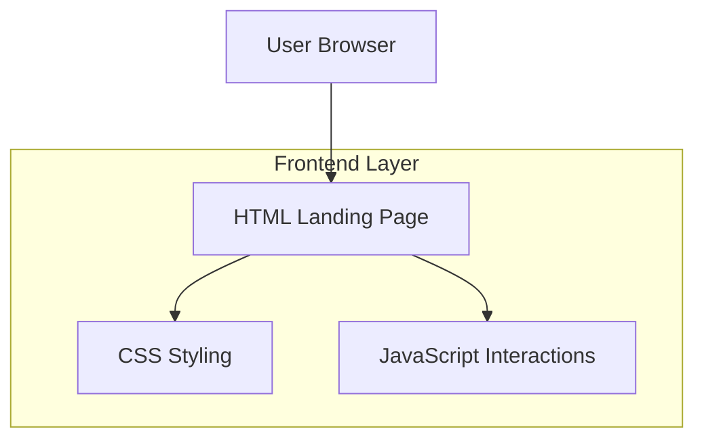

## 1. Architecture design



## 2. Technology Description

- **Frontend**: HTML5 + CSS3 + Vanilla JavaScript
- **Initialization Tool**: None (static HTML project)
- **Backend**: None (client-side only)
- **External Services**: Font Awesome for icons, Google Fonts for typography

## 3. Route definitions

| Route | Purpose |
|-------|---------|
| /index.html | Main landing page with all sections |
| /style.css | Global styles and component styling |
| /script.js | Interactive functionality and animations |

## 4. Component Architecture

### 4.1 Core Components

**Header Component**
```html
<header class="glass-header">
  <nav class="nav-container">
    <div class="logo">Skill<span class="accent">Sphere</span></div>
    <ul class="nav-links">
      <li><a href="#home">Home</a></li>
      <li><a href="#why">Why</a></li>
      <li><a href="#domains">Domains</a></li>
      <li><a href="#courses">Courses</a></li>
      <li><a href="#impact">Impact</a></li>
      <li><a href="#partners">Partners</a></li>
      <li><a href="#contact">Contact</a></li>
    </ul>
    <button class="cta-button">Get Guidance</button>
    <button class="mobile-menu-toggle">☰</button>
  </nav>
</header>
```

**Hero Section Component**
```html
<section class="hero">
  <div class="hero-content">
    <h1>Clarity in a world of endless courses</h1>
    <p>Expert curation, verification, and personalized guidance for your learning journey</p>
    <form class="search-form">
      <input type="text" placeholder="What do you want to learn?">
      <select class="domain-select">
        <option>All Domains</option>
        <option>Technology</option>
        <option>Business</option>
        <option>Arts & Humanities</option>
      </select>
      <select class="level-select">
        <option>Any Level</option>
        <option>Beginner</option>
        <option>Intermediate</option>
        <option>Advanced</option>
      </select>
      <label class="certificate-checkbox">
        <input type="checkbox"> Certificate
      </label>
      <button type="submit" class="primary-button">Search</button>
    </form>
    <div class="secondary-actions">
      <a href="#courses" class="secondary-button">Browse curated tracks</a>
      <a href="#why" class="text-link">Why SkillSphere?</a>
    </div>
  </div>
  <div class="hero-illustration">
    <!-- Decorative abstract shapes -->
  </div>
</section>
```

**Feature Card Component**
```html
<div class="feature-card glass-card">
  <div class="icon-chip">
    <i class="fas fa-search"></i>
  </div>
  <h3>Curated & Verified</h3>
  <p>Every course is hand-picked and verified by learning experts</p>
</div>
```

## 5. CSS Architecture

### 5.1 Design System Variables
```css
:root {
  /* Colors */
  --color-gold: #c8a96a;
  --color-indigo: #203a5c;
  --color-ink: #0b1220;
  --color-ivory: #f7f5ef;
  --color-muted: #7a869a;
  
  /* Typography */
  --font-heading: 'Fraunces', serif;
  --font-body: 'Inter', sans-serif;
  
  /* Spacing */
  --container-max: 1200px;
  --section-padding: 4rem;
  
  /* Effects */
  --glass-blur: 12px;
  --premium-shadow: 0 8px 32px rgba(0, 0, 0, 0.1);
  --border-radius: 16px;
}
```

### 5.2 Responsive Breakpoints
```css
/* Tablet */
@media (max-width: 980px) {
  .nav-links {
    display: none;
  }
  .mobile-menu-toggle {
    display: block;
  }
}

/* Mobile */
@media (max-width: 560px) {
  .hero-content {
    text-align: center;
  }
  .search-form {
    flex-direction: column;
  }
  .domains-grid,
  .courses-grid {
    grid-template-columns: 1fr;
  }
}
```

## 6. JavaScript Functionality

### 6.1 Core Features

**Theme Toggle**
```javascript
const themeToggle = document.querySelector('.theme-toggle');
const body = document.body;

function toggleTheme() {
  const currentTheme = body.getAttribute('data-theme');
  const newTheme = currentTheme === 'dark' ? 'light' : 'dark';
  body.setAttribute('data-theme', newTheme);
  localStorage.setItem('theme', newTheme);
}

themeToggle.addEventListener('click', toggleTheme);
```

**Scroll Reveal Animation**
```javascript
const observerOptions = {
  threshold: 0.1,
  rootMargin: '0px 0px -50px 0px'
};

const observer = new IntersectionObserver((entries) => {
  entries.forEach(entry => {
    if (entry.isIntersecting) {
      entry.target.classList.add('reveal');
    }
  });
}, observerOptions);

document.querySelectorAll('.card, .stat-block, .testimonial').forEach(el => {
  observer.observe(el);
});
```

**Mobile Navigation**
```javascript
const mobileToggle = document.querySelector('.mobile-menu-toggle');
const navLinks = document.querySelector('.nav-links');

mobileToggle.addEventListener('click', () => {
  navLinks.classList.toggle('mobile-active');
});
```

**Smooth Scrolling**
```javascript
document.querySelectorAll('a[href^="#"]').forEach(anchor => {
  anchor.addEventListener('click', function (e) {
    e.preventDefault();
    const target = document.querySelector(this.getAttribute('href'));
    if (target) {
      target.scrollIntoView({
        behavior: 'smooth',
        block: 'start'
      });
    }
  });
});
```

## 7. Performance Considerations

- **Font Loading**: Use `font-display: swap` for web fonts
- **Image Optimization**: Compress decorative images, use modern formats (WebP)
- **CSS Optimization**: Minimize CSS, use efficient selectors
- **JavaScript**: Lightweight vanilla JS, no external dependencies beyond icons/fonts
- **Animation Performance**: Use CSS transforms and opacity for smooth animations

## 8. Accessibility Features

- **Color Contrast**: Maintain WCAG AA compliance (4.5:1 for normal text, 3:1 for large text)
- **Keyboard Navigation**: All interactive elements accessible via keyboard
- **Screen Reader Support**: Proper ARIA labels on form controls
- **Focus Indicators**: Clear focus styles for keyboard navigation
- **Semantic HTML**: Use appropriate HTML5 semantic elements